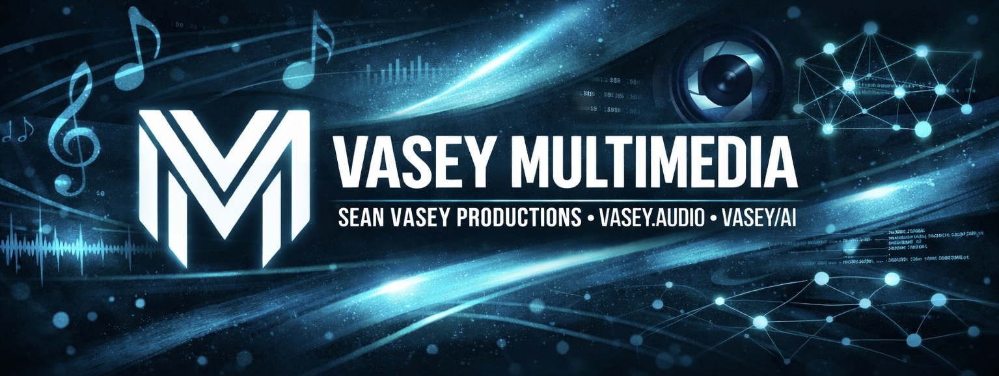
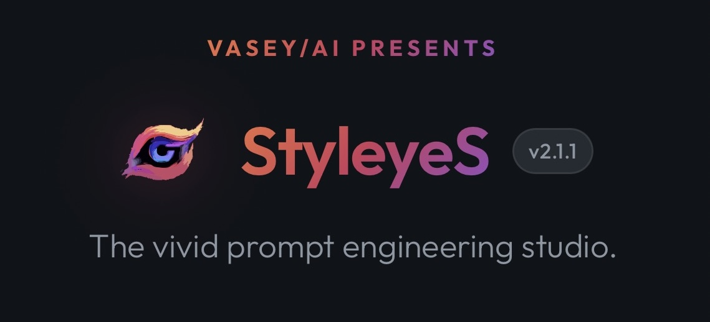
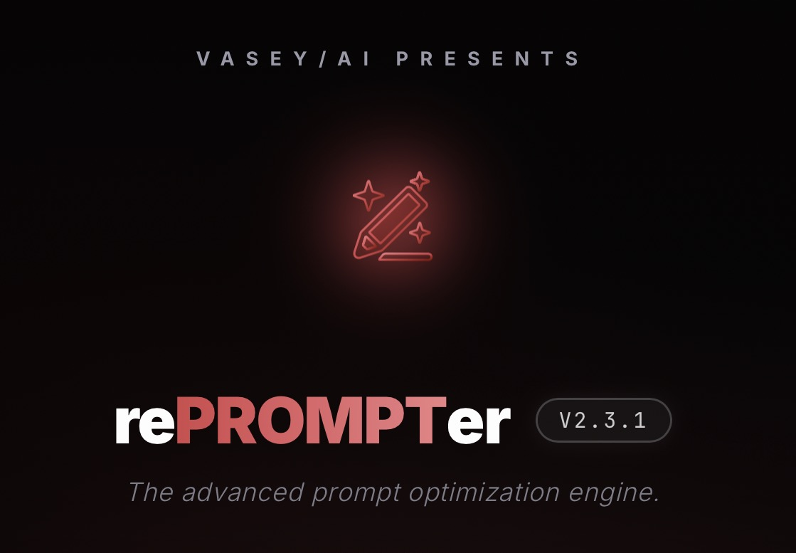
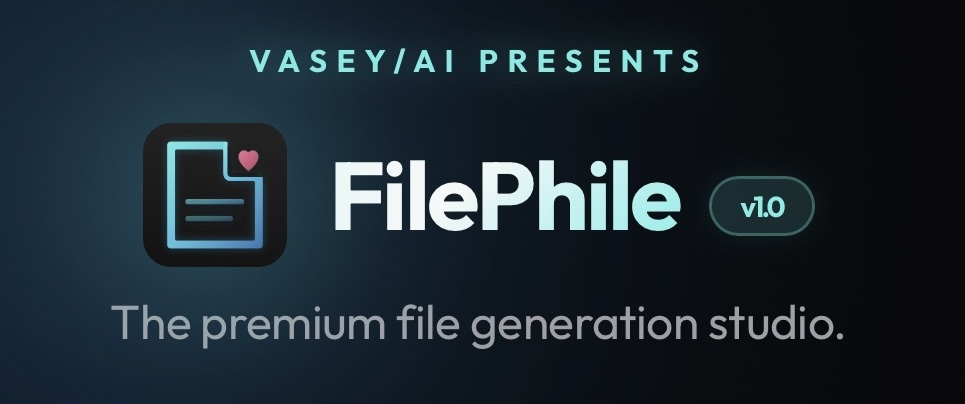
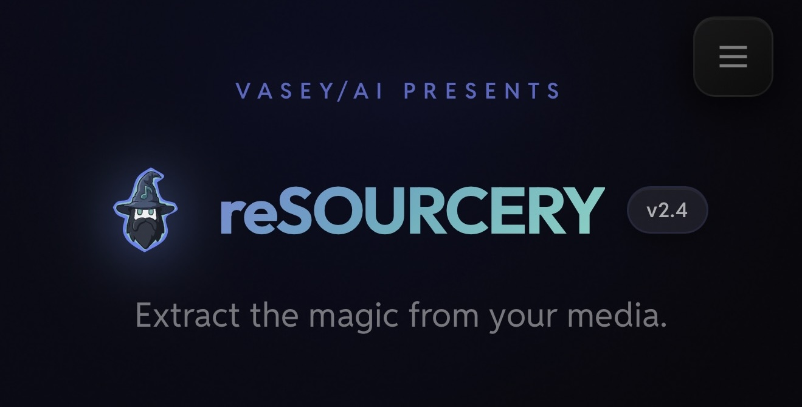
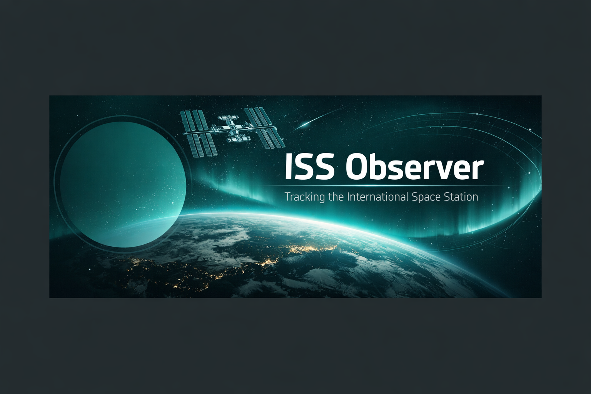
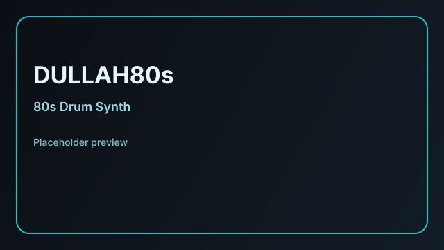

<div align="center">



<table>
<tr>
<td align="center" width="180">

</td>
<td>

# Sean Vasey · VASEY/AI + Vasey Multimedia

**AI + media developer building design-forward creative tools, prompt systems, and interactive audio experiences.**

</td>
</tr>
</table>

[](mailto:sean@vaseyai.com)
[](https://x.com/SeannyV)
[](https://instagram.com/vasey.audio)
[](https://linkedin.com/in/seanmvasey)
[](https://seanvasey.link)

</div>

---

## Product Overview

This repository is the public profile and portfolio hub for Sean Vasey, showcasing production applications across **AI tooling**, **prompt engineering**, **media workflows**, and **interactive audio products**.

## Features

- Branded header with official Vasey Multimedia banner + portrait imagery.
- Curated live app showcase with custom placard cards.
- Skills matrix with "flag" status indicators for core engineering and creative capabilities.
- Security, contribution, and changelog documentation for repo governance.
- Lightweight CI for Markdown quality checks.

## Project Gallery

<table>
<tr>
<td align="center" width="33%">
<a href="https://styleyes.vercel.app">
<br>
<strong>StyleyeS</strong>
</a><br>
<sub>Prompt engineering studio for AI image generation with layered style recipes and model targeting.</sub>
</td>
<td align="center" width="33%">
<a href="https://reprompt.vercel.app">
<br>
<strong>rePROMPTer</strong>
</a><br>
<sub>Advanced prompt optimization engine for richer LLM and image model outcomes.</sub>
</td>
<td align="center" width="33%">
<a href="https://filephile.vercel.app">
<br>
<strong>FilePhile</strong>
</a><br>
<sub>Browser-based file generation studio with multi-format exports and editing tools.</sub>
</td>
</tr>
<tr>
<td align="center" width="33%">
<a href="https://resourcery.vercel.app">
<br>
<strong>reSOURCERY</strong>
</a><br>
<sub>Client-side media extraction + conversion workflows powered by FFmpeg.wasm.</sub>
</td>
<td align="center" width="33%">
<a href="https://seanvasey.github.io/VASEYSPACE">
<br>
<strong>VASEYSPACE / ISS Observer</strong>
</a><br>
<sub>Real-time ISS tracking experience with pass prediction and viewing guidance.</sub>
</td>
<td align="center" width="33%">
<a href="https://seanvasey.github.io/DULLAH80s">
<br>
<strong>DULLAH80s</strong>
</a><br>
<sub>Web Audio API drum-machine sequencer with effects and live performance controls.</sub>
</td>
</tr>
</table>

## App Status Flags

| App | Status | Platform | Primary Domain |
| --- | --- | --- | --- |
| StyleyeS | 🟢 Live | Vercel | Prompt Engineering + AI Image Workflows |
| rePROMPTer | 🟢 Live | Vercel | Prompt Optimization |
| FilePhile | 🟢 Live | Vercel | File Tools + Frontend UX |
| reSOURCERY | 🟢 Live | Vercel | Media Extraction + FFmpeg.wasm |
| VASEYSPACE | 🟢 Live | GitHub Pages | Space Data + Frontend Data Viz |
| DULLAH80s | 🟢 Live | GitHub Pages | Web Audio + Sequencing |

## Skills Flags (Developer Profile)

| Skill Area | Flag | Notes |
| --- | --- | --- |
| Prompt Engineering | ✅ Expert | Structured prompt frameworks, optimization, and workflow UX. |
| Frontend Engineering | ✅ Expert | HTML/CSS/JavaScript/TypeScript, responsive and mobile-first UI patterns. |
| AI Product Design | ✅ Expert | Practical creator-facing tools with clear interaction models. |
| Audio Product Development | ✅ Expert | Browser audio systems, sequencing, and production workflow tooling. |
| DevOps / Delivery | ✅ Strong | Vercel + GitHub Pages deployment and CI discipline. |

## Tech Stack

- **Languages:** JavaScript, TypeScript, HTML5, CSS3
- **Runtime/Browser APIs:** Web Audio API, Canvas/Web platform APIs
- **Media Tooling:** FFmpeg.wasm
- **Hosting:** Vercel, GitHub Pages
- **Collaboration:** GitHub Actions, pull-request workflows

## Setup / Run / Build / Test

This repository is documentation-first and does not ship a standalone runtime service.

```bash
# Validate markdown style
npx --yes markdownlint-cli "**/*.md"

# Check links in README
npx --yes markdown-link-check README.md
```

## Environment Variables

No runtime environment variables are required for this profile repository.
A placeholder `.env.example` is included for baseline consistency.

## Architecture / Folder Structure

```text
assets/
  brand/         # top-level brand imagery (banner)
  portraits/     # profile portrait assets
  placards/      # app-specific card artwork for portfolio grid
  placeholders/  # legacy fallback cards still in use where needed
docs/
  MANIFEST.md    # file inventory and artifact purpose
.github/workflows/
  ci.yml         # markdown validation on push/PR
```

## Deployment Notes

- Portfolio apps linked in this README are deployed externally on **Vercel** and **GitHub Pages**.
- This repository itself is GitHub-hosted profile/documentation content.

## Usage Examples

- Browse projects and click directly into live deployed applications.
- Use linked repos to inspect source code for individual products.

## Asset and Licensing Notes

- Code/documentation in this repo is licensed under MIT. See `LICENSE`.
- Portfolio image assets are branded works by Sean Vasey and should not be redistributed outside portfolio/reference use without permission.

---

<div align="center">

<br>
<strong><a href="https://vaseyai.com">vaseyai.com</a></strong> · <strong><a href="https://vasey.audio">vasey.audio</a></strong> · <strong><a href="https://seanvasey.link">seanvasey.link</a></strong>
</div>
