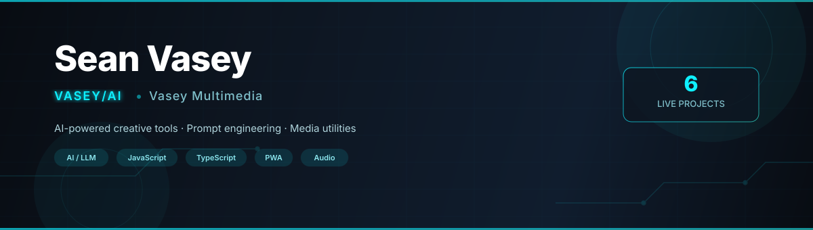
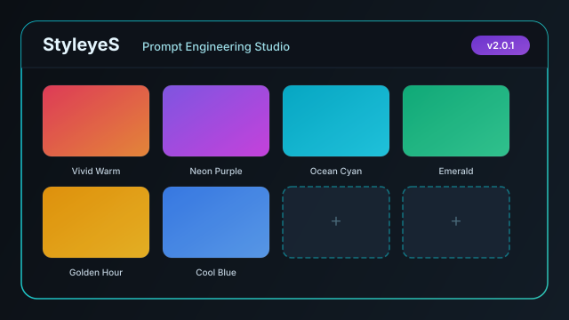
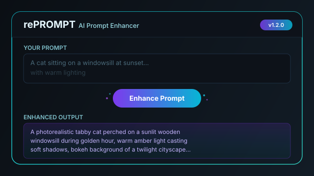
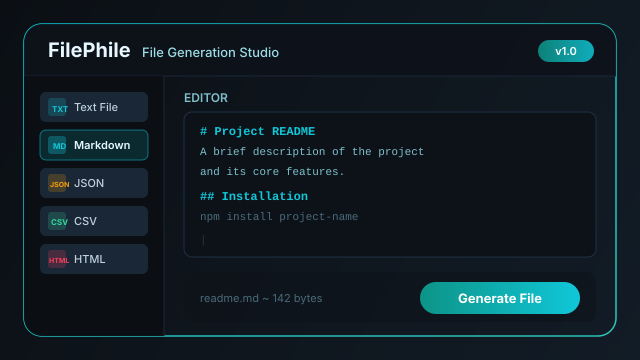
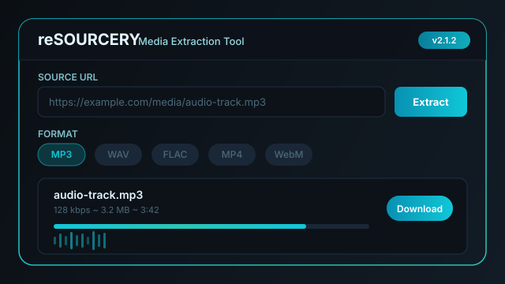
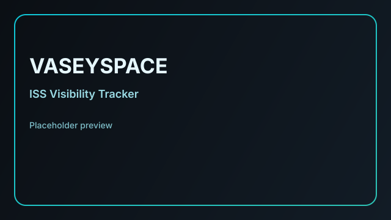
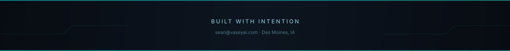

<div align="center">



[](https://vaseyai.com)&nbsp;
[](https://vasey.audio)

<br>

**`AI & media developer building design-forward creative tools, prompt engineering systems, and interactive audio experiences.`**

<br>

[](mailto:sean@vaseyai.com)&nbsp;
[](https://x.com/SeannyV)&nbsp;
[](https://instagram.com/vasey.audio)&nbsp;
[](https://soundcloud.com/seanvasey)&nbsp;
[](https://linkedin.com/in/seanvasey)&nbsp;
[](https://seanvasey.link)

</div>

<br>


## About

I design and ship practical tools that sit at the intersection of **AI** and **media**—prompt engineering studios, file utilities, media extraction pipelines, and browser-based instruments. Everything I build is mobile-first, PWA-ready, and deployed live.

Outside of code, I produce music and develop audio experiences under **Vasey Multimedia**, bringing 20+ years of creative arts experience into everything I ship.


## Enterprises

<table>
<tr>
<td width="50%" valign="top">

### ⚡ VASEY/AI
AI-assisted media tools and creative automation. Focused on prompt engineering systems, LLM-powered utilities, and tools that make AI accessible for creators.

**Focus areas:** Prompt engineering · AI image generation · File utilities · Media extraction · Creative automation

</td>
<td width="50%" valign="top">

### 🎵 Vasey Multimedia
Music production tools, interactive instruments, and audio experiences. Building browser-based creative instruments that are accessible on any device.

**Focus areas:** Audio synthesis · Drum machines · Music production · Sound design · Interactive audio

</td>
</tr>
</table>


## Projects

> All projects are live and deployed. Click any preview to visit the app.

<br>

<table>
<tr>
<td align="center" width="33%">
<a href="https://styleyes.vercel.app">
<br>
<strong>StyleyeS</strong>
</a><br>
<sub>Prompt engineering studio for AI image generation. Curated style presets, real-time prompt construction, and visual controls for crafting vivid image prompts.</sub><br><br>
<a href="https://styleyes.vercel.app"></a>
<a href="https://github.com/SeanVasey/StyleyeS"></a>
</td>
<td align="center" width="33%">
<a href="https://reprompt.vercel.app">
<br>
<strong>rePROMPT</strong>
</a><br>
<sub>AI prompt enhancer that refines, expands, and optimizes prompts for richer, more detailed outputs from any LLM or image model.</sub><br><br>
<a href="https://reprompt.vercel.app"></a>
<a href="https://github.com/SeanVasey/rePROMPT"></a>
</td>
<td align="center" width="33%">
<a href="https://filephile.vercel.app">
<br>
<strong>FilePhile</strong>
</a><br>
<sub>File generation studio for creating, editing, and exporting documents. Supports TXT, Markdown, JSON, CSV, HTML and more—all in-browser.</sub><br><br>
<a href="https://filephile.vercel.app"></a>
<a href="https://github.com/SeanVasey/FilePhile"></a>
</td>
</tr>
<tr><td colspan="3">&nbsp;</td></tr>
<tr>
<td align="center" width="33%">
<a href="https://resourcery.vercel.app">
<br>
<strong>reSOURCERY</strong>
</a><br>
<sub>Fast media extraction and conversion tool. Pull audio and video from web sources, convert between formats, and download—no installs needed.</sub><br><br>
<a href="https://resourcery.vercel.app"></a>
<a href="https://github.com/SeanVasey/reSOURCERY"></a>
</td>
<td align="center" width="33%">
<a href="https://seanvasey.github.io/VASEYSPACE">
<br>
<strong>VASEYSPACE</strong>
</a><br>
<sub>Real-time ISS tracker and naked-eye visibility observer. Shows the station's live position, pass predictions, and best viewing windows for your location.</sub><br><br>
<a href="https://seanvasey.github.io/VASEYSPACE"></a>
<a href="https://github.com/SeanVasey/VASEYSPACE"></a>
</td>
<td align="center" width="33%">
<a href="https://seanvasey.github.io/DULLAH80s">
<br>
<strong>DULLAH80s</strong>
</a><br>
<sub>Mobile-ready 80s drum synthesizer and step sequencer. Classic drum machine sounds with a modern interface—play, sequence, and perform right in the browser.</sub><br><br>
<a href="https://seanvasey.github.io/DULLAH80s"></a>
<a href="https://github.com/SeanVasey/DULLAH80s"></a>
</td>
</tr>
</table>


## Tech Stack

<div align="center">


</div>

| Domain | Tools & Technologies |
| --- | --- |
| **AI / LLM** | Prompt engineering, LLM integration, creative automation, AI image generation workflows |
| **Frontend** | JavaScript (ESNext), TypeScript, HTML5, CSS3, responsive design |
| **Architecture** | PWA-first, mobile-ready, offline-capable, single-page apps |
| **Audio** | Web Audio API, synthesis, sequencing, sample-based instruments |
| **Deployment** | Vercel, GitHub Pages, CI/CD workflows |


## Current Focus

```
 ╔══════════════════════════════════════════════════════════════╗
 ║  → Expanding StyleyeS with new style presets & model        ║
 ║    support for next-gen image generators                     ║
 ║  → Building rePROMPT v2 with multi-model prompt             ║
 ║    optimization and comparison workflows                    ║
 ║  → Improving reSOURCERY extraction pipeline for broader     ║
 ║    format support and faster conversions                    ║
 ║  → Exploring new browser-based audio tools under            ║
 ║    Vasey Multimedia                                         ║
 ╚══════════════════════════════════════════════════════════════╝
```


<div align="center">

## GitHub Stats


</div>

<br>

<div align="center">



<sub>

**[vaseyai.com](https://vaseyai.com)** · **[vasey.audio](https://vasey.audio)** · **[seanvasey.link](https://seanvasey.link)**

</sub>

</div>
