

  
  &nbsp;&nbsp;&nbsp;
  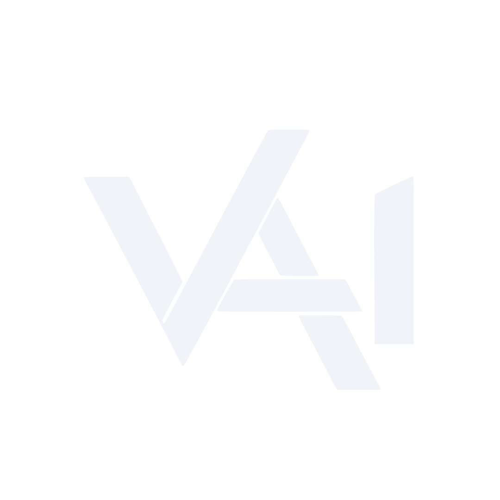

<h1>Sean Vasey</h1>

<strong>Creative technologist building design-forward AI, web, audio, and multimedia products.</strong>

  
  
  
  
  

<code>VASEY/DEV</code> · <code>VASEY/AI</code> · <code>VASEY.AUDIO</code> · <code>Vasey Multimedia</code>

## Building at the intersection of sound, systems, and story

I bring more than two decades of music production, composition, audio engineering, and sound design into software product development. My work connects that creative practice with full-stack engineering, multimodal AI, prompt systems, and mobile-first interaction design.

Through **studio/VASEY**, I am building a connected portfolio of creator-facing products: focused tools with distinctive identities, practical workflows, and enough technical restraint to remain useful after the launch-day confetti has settled.

## Featured products

Every preview below is standardized to the same 16:9 frame and represents the product's current interface and visual system. Product versions stay in the source repositories—not fossilized inside portfolio art.

<table>
  <tr>
    <td width="50%" valign="top">
      <a href="https://vizion-io.vercel.app/">
        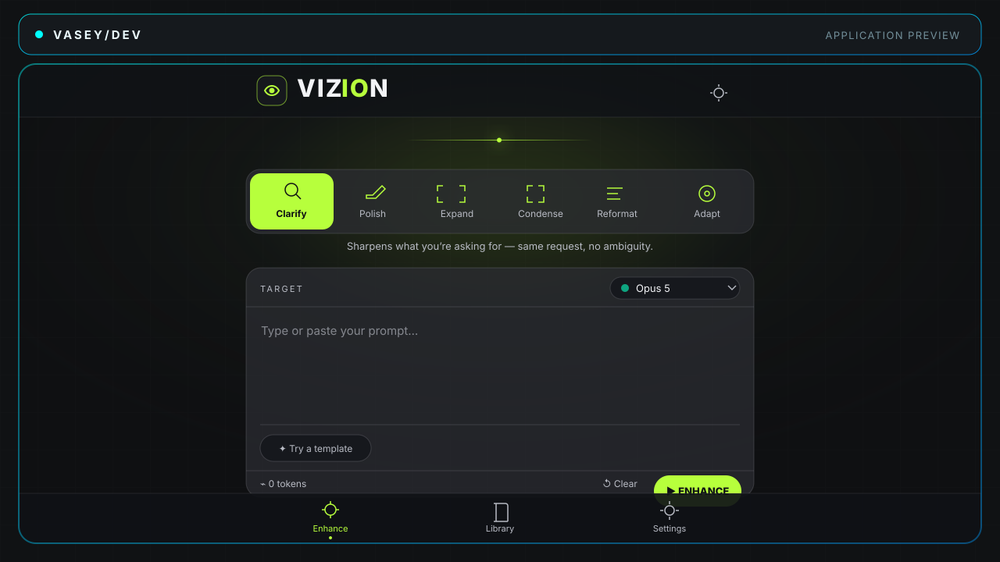
      </a>
       
      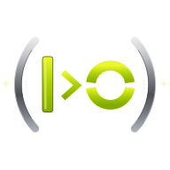
      <strong>VIZION</strong> 
      <strong>Live</strong> · VASEY/AI × VASEY/DEV
      
Transforms rough prompts into model-aware, structured instructions through a focused mobile-first refinement workflow.

      <a href="https://vizion-io.vercel.app/">Open app</a> · <a href="https://github.com/SeanVasey/VIZION">Source</a>
    </td>
    <td width="50%" valign="top">
      <a href="https://reprompter2.vercel.app/">
        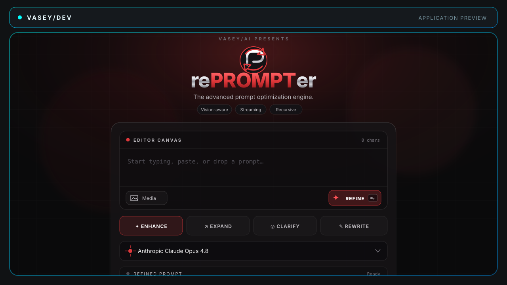
      </a>
       
      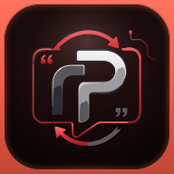
      <strong>rePROMPTer 2</strong> 
      <strong>Live</strong> · VASEY/AI × VASEY/DEV
      
Recursive, vision-aware prompt refinement with configurable modes, model selection, streaming output, and reusable history.

      <a href="https://reprompter2.vercel.app/">Open app</a> · <a href="https://github.com/SeanVasey/rePROMPTer2">Source</a>
    </td>
  </tr>
  <tr>
    <td width="50%" valign="top">
      <a href="https://ikonik-zeta.vercel.app/">
        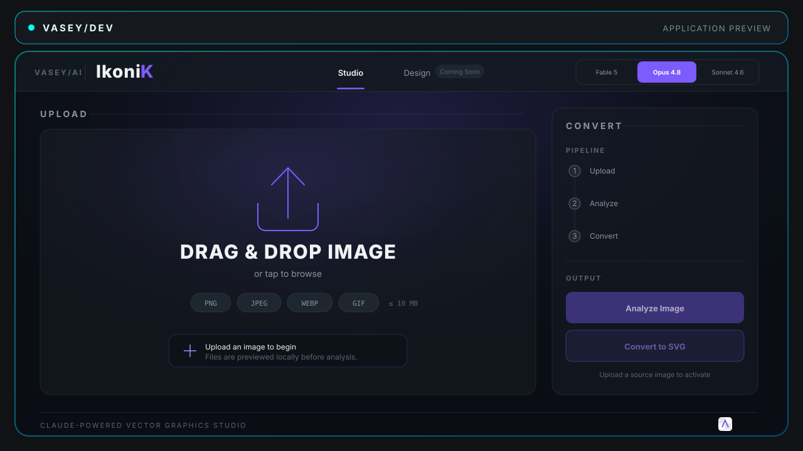
      </a>
       
      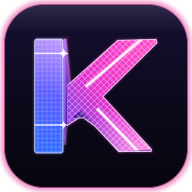
      <strong>IkoniK</strong> 
      <strong>Live</strong> · VASEY/AI × VASEY/DEV
      
Claude-powered raster-to-vector studio producing optimized SVG output with visual analysis and fidelity tooling.

      <a href="https://ikonik-zeta.vercel.app/">Open app</a> · <a href="https://github.com/SeanVasey/IkoniK">Source</a>
    </td>
    <td width="50%" valign="top">
      <a href="https://page-x.vercel.app/">
        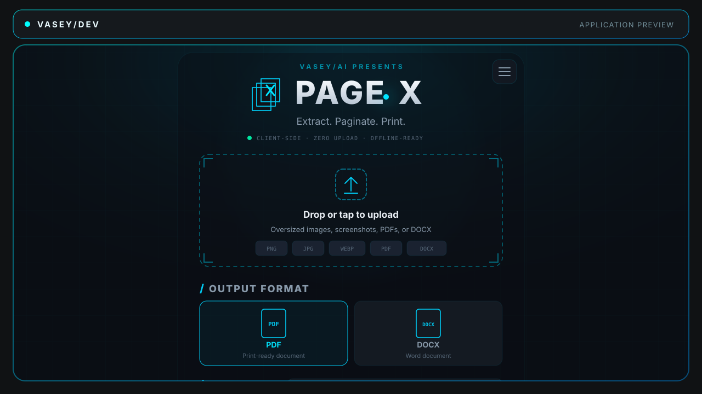
      </a>
       
      
      <strong>PAGE•X</strong> 
      <strong>Live</strong> · VASEY/AI × VASEY/DEV
      
Extracts long images, scrolling captures, and PDFs into correctly paginated PDF or DOCX documents.

      <a href="https://page-x.vercel.app/">Open app</a> · <a href="https://github.com/SeanVasey/PAGE-X">Source</a>
    </td>
  </tr>
  <tr>
    <td width="50%" valign="top">
      <a href="https://styleyes.vercel.app/">
        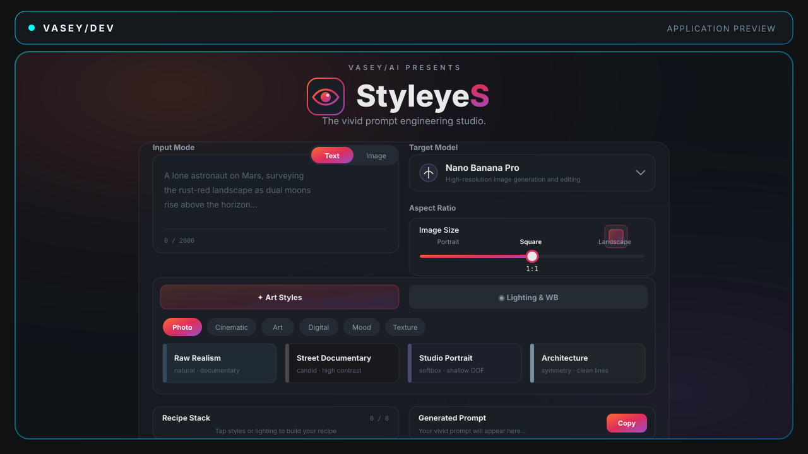
      </a>
       
      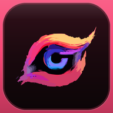
      <strong>StyleyeS</strong> 
      <strong>Live</strong> · VASEY/AI × VASEY/DEV
      
Builds image-generation prompts from curated visual styles, lighting systems, aspect ratios, and model-specific controls.

      <a href="https://styleyes.vercel.app/">Open app</a> · <a href="https://github.com/SeanVasey/StyleyeS">Source</a>
    </td>
    <td width="50%" valign="top">
      <a href="https://resourcery.vercel.app/">
        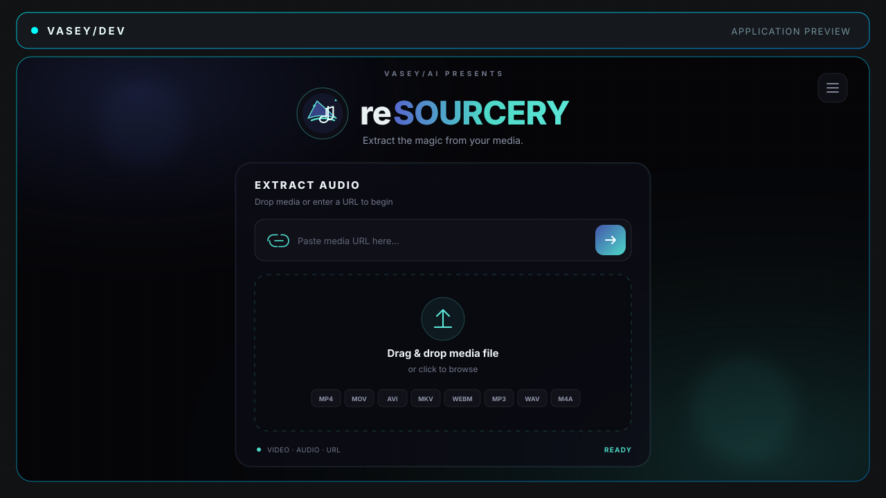
      </a>
       
      
      <strong>reSOURCERY</strong> 
      <strong>Live</strong> · VASEY.AUDIO × VASEY/DEV
      
Extracts and converts audio from media, then analyzes waveform, tempo, and key with an FFmpeg.wasm-powered workflow.

      <a href="https://resourcery.vercel.app/">Open app</a> · <a href="https://github.com/SeanVasey/reSOURCERY">Source</a>
    </td>
  </tr>
</table>

## More shipped work

| Product | Status | What it does | Links |
| --- | --- | --- | --- |
| **FilePhile** | Live | Browser-based text-file editor and generator with import, preview, multi-format downloads, and offline PWA support. | [App](https://filephile.vercel.app/) · [Source](https://github.com/SeanVasey/FilePhile) |
| **ISS Observer — VASEY/SPACE** | Live | Real-time ISS tracking, pass predictions, 2D/3D visualization, and location-aware viewing guidance. | [App](https://iss-observer.vercel.app/) · [Source](https://github.com/SeanVasey/ISS-Observer) |
| **REGENESYS** | Live | Visual prompt reverse-engineering studio for image analysis, hybrid style synthesis, controlled variants, and platform-targeted prompts. | [App](https://regenesys.vercel.app/) · [Source](https://github.com/SeanVasey/REGENESYS) |
| **DULLAH80s** | Live | Web Audio drum machine with synthesized pads, a 16-step sequencer, effects, and performance controls. | [App](https://seanvasey.github.io/DULLAH80s/) · [Source](https://github.com/SeanVasey/DULLAH80s) |

## The studio/VASEY ecosystem

| Studio identity | Focus |
| --- | --- |
| **studio/VASEY** | Parent studio connecting the full creative, technology, music, and product ecosystem. |
| **Vasey Multimedia** | Cross-media production, creative direction, design, and interactive experiences. |
| **VASEY/DEV** | Software product engineering, web applications, platform architecture, and delivery standards. |
| **VASEY/AI** | LLM, multimodal, agentic, and creator-focused AI research and product development. |
| **VASEY.AUDIO** | Music production, composition, sound design, audio engineering, and creative audio technology. |
| **Sean Vasey Productions + Vasey Music Group** | Production and music identities supporting original work, artists, and releases. |

## Capabilities

- **AI and agentic systems:** multimodal product design, prompt architecture, tool-using workflows, model routing, evaluation, and production integrations.
- **Product and web engineering:** TypeScript, JavaScript, Next.js, React, Supabase, Vercel, PWAs, browser APIs, responsive UX, accessibility, and secure delivery.
- **Audio and creative technology:** Web Audio, FFmpeg.wasm, JUCE exploration, synthesis, MIDI, sound design, composition, mixing, and creator workflow design.

## Current focus

- Advancing **VIZION** as a polished, mobile-first prompt intelligence product.
- Establishing **VASEY/DEV** as the shared engineering and product-quality layer across the studio/VASEY portfolio.
- Developing original audio, synthesis, and multimodal creation systems through **VASEY.AUDIO** and **VASEY/AI**.

<strong>About this profile repository</strong>

This repository contains the public GitHub profile for Sean Vasey. It is documentation-first and does not ship a standalone runtime service.

- Markdown quality and link validation run in GitHub Actions.
- Profile source is licensed under the [MIT License](LICENSE).
- Branded imagery remains the property of Sean Vasey and the studio/VASEY ecosystem unless otherwise noted.

<strong>Designed and built in Des Moines, Iowa.</strong> 
Music-trained. Product-minded. Mildly suspicious of unnecessary dashboards.

