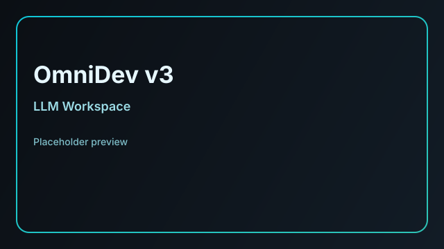
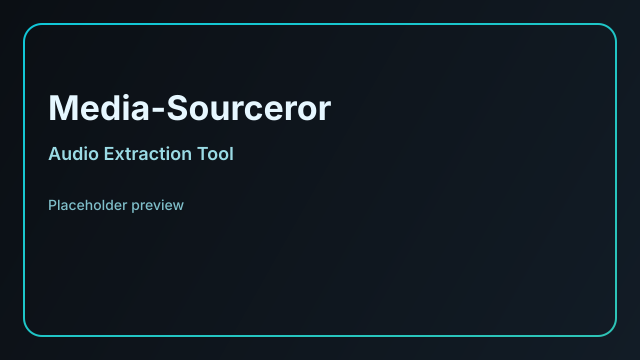

# Sean Vasey

          

AI & media developer focused on creative tooling, prompt engineering, and interactive audio/visual experiences. This profile centers on **VASEY/AI** and **Vasey Multimedia**, with active work in AI-assisted creation, media utilities, and music production.

**Contact:** sean@vaseyai.com

## Profile Blurb
I build practical, design-forward tools that blend AI with media workflows—from prompt engineering studios to fast, mobile-ready utilities. I also develop music production tools and experiments under **Vasey Multimedia**, with an emphasis on accessible, creative instruments and audio tooling.

## Enterprises & Focus
- **VASEY/AI** — AI-assisted media tools, prompt systems, and creative automation.
- **Vasey Multimedia** — music production tools, instruments, and interactive audio experiences.

## Apps & Projects
Status reflects known deployed URLs (Vercel/GitHub Pages) and active development.

| Preview | Project | Description | Status | Live | Repo |
| --- | --- | --- | --- | --- | --- |
|  | **StyleyeS** | Vivid prompt engineering studio for AI image generation with curated styles and controls. | Deployed | https://styleyes.vercel.app | https://github.com/SeanVasey/StyleyeS |
|  | **OmniDev v3** | Personal LLM exploration and tooling environment. | Deployed | https://omnidev-v3.vercel.app | https://github.com/SeanVasey/OmniDev-v3 |
|  | **FilePhile** | Mobile-first copy/paste document creator and saver. | Deployed | https://filephile.vercel.app | https://github.com/SeanVasey/FilePhile |
|  | **Media-Sourceror** | Fast, personal-use audio extraction and conversion utility. | Deployed (GitHub Pages) | https://seanvasey.github.io/Media-Sourceror | https://github.com/SeanVasey/Media-Sourceror |
|  | **VASEYSPACE** | ISS tracking and naked-eye visibility observer. | Deployed (GitHub Pages) | https://seanvasey.github.io/VASEYSPACE | https://github.com/SeanVasey/VASEYSPACE |
|  | **DULLAH80s** | Mobile-ready 80s drum synth and sequencer. | Deployed (GitHub Pages) | https://seanvasey.github.io/DULLAH80s | https://github.com/SeanVasey/DULLAH80s |

## Now Building (Auto-updated)
<!-- NOW_BUILDING_START -->
**Automated feed placeholder.**
- This section updates from `now-building` labeled issues across repositories.
- It also highlights the most recently updated active repo with frequent commits.
- If multiple projects are active, the top two are shown.

> Manual fallback: update the Roadmap section below with dates, milestone notes, and release targets.
<!-- NOW_BUILDING_END -->

## Roadmap & Milestones (Fill in)
Use the placeholders below to add milestone notes, projected completion dates, and major updates.

### StyleyeS
- **Current phase:** [placeholder]
- **Projected release:** [placeholder]
- **Milestones:**
  - [placeholder]
  - [placeholder]
  - [placeholder]

### OmniDev v3
- **Current phase:** [placeholder]
- **Projected release:** [placeholder]
- **Milestones:**
  - [placeholder]
  - [placeholder]
  - [placeholder]

### FilePhile
- **Current phase:** [placeholder]
- **Projected release:** [placeholder]
- **Milestones:**
  - [placeholder]
  - [placeholder]
  - [placeholder]

### Media-Sourceror
- **Current phase:** [placeholder]
- **Projected release:** [placeholder]
- **Milestones:**
  - [placeholder]
  - [placeholder]
  - [placeholder]

### VASEYSPACE
- **Current phase:** [placeholder]
- **Projected release:** [placeholder]
- **Milestones:**
  - [placeholder]
  - [placeholder]
  - [placeholder]

### DULLAH80s
- **Current phase:** [placeholder]
- **Projected release:** [placeholder]
- **Milestones:**
  - [placeholder]
  - [placeholder]
  - [placeholder]

## Tech Stack
- **AI/LLM tooling:** Prompt engineering, creative automation
- **Web:** JavaScript, TypeScript, HTML, CSS
- **UX:** Mobile-first, PWA-ready experiences
- **Media:** Audio tooling, sequencing, interactive music utilities

## Featured Media
- StyleyeS (Prompt studio): https://styleyes.vercel.app
- OmniDev v3 (LLM workspace): https://omnidev-v3.vercel.app
- DULLAH80s (Drum synth): https://seanvasey.github.io/DULLAH80s

## GitHub Highlights
- Pinned repos: StyleyeS, OmniDev-v3, FilePhile, Media-Sourceror, VASEYSPACE, DULLAH80s
- Add GitHub profile README images (app previews or banners) for quick visual context

## GitHub Profile Best Practices (Applied)
- Clear, focused bio and mission statement
- Enterprise context and creative focus areas
- Live product links + repositories
- Direct contact email

## Notes
If any GitHub Pages links need corrections, let me know and I’ll update them to match the configured Pages URLs.